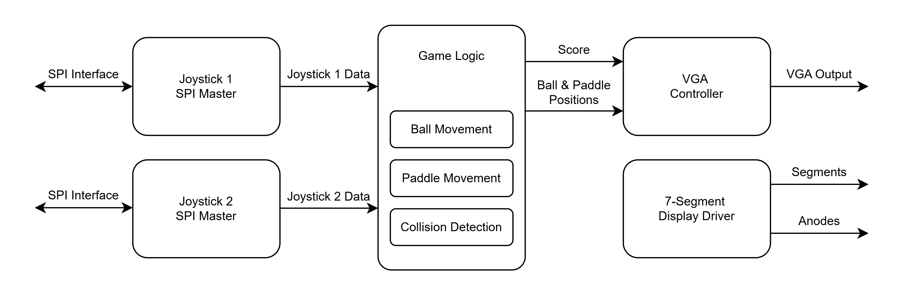

# FPGA Pong

A hardware implementation of the classic Pong game developed for the Digilent 
Basys 3 FPGA using SystemVerilog.

## Features

* Real-time Pong gameplay implemented in FPGA logic
* Collision detection between the ball, paddles, and game boundaries
* Variable ball deflection angle based on where ball hits paddle
* Two-player control using analog joysticks
* SPI interface for reading joystick inputs
* 640×480 @ 60 Hz VGA output for game display

## Block Diagram



## Development

### Requirements

* Software
    * Xilinx Vivado
    * Python (NumPy, OpenCV)

* Hardware
    * Digilent Basys 3 FPGA Board
    * VGA Monitor
    * Pmod JSTK2: Two-axis Joystick (x2)

### Building the Project

1. Clone the repository
```
git clone https://github.com/JackPonder/fpga-pong.git
```

3. Generate memory initialization files
```
python scripts/generate_mem.py
```

3. Write bitstream
```
vivado -mode batch -source scripts/write_bitstream.tcl
```

4. Program device
```
vivado -mode batch -source scripts/program_device.tcl
```

## Authors

* Jack Ponder [@JackPonder](https://github.com/JackPonder) 
* Zachary Kuo [@Ch3rud1m](https://github.com/ch3rud1m)
